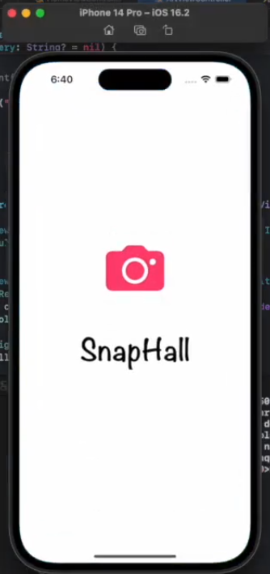
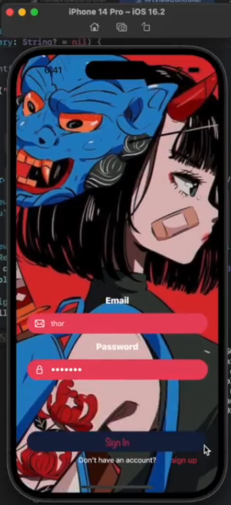
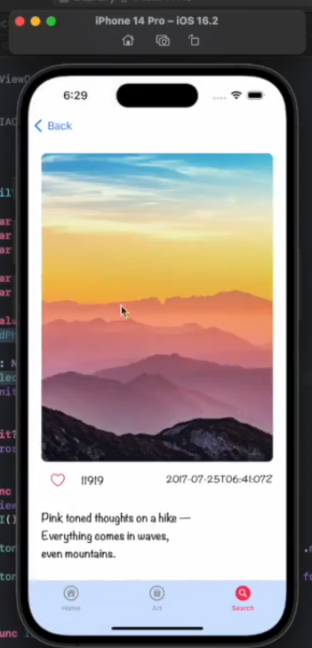
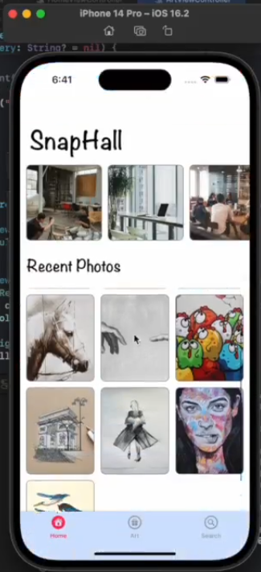
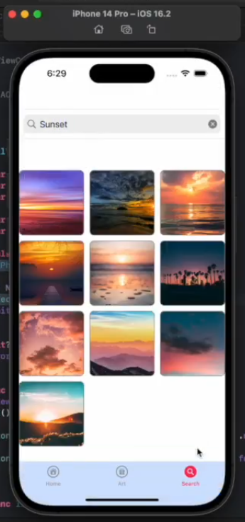

# SnapHall 📷

SnapHall is a photo grallery app that you use to view and enjoy images.\
demonstrated on linkedin [LinkedIn Post](https://www.linkedin.com/posts/elias-kekana_swift-xcode-uikit-activity-7025526842807734272-C9F8?utm_source=share&utm_medium=member_desktop)

### Some concepts that were utilised in the development of this app
- Refactoring Views
- Model View Controller (MVC) Architecture
- Unsplashed API
- JSON & API Requests/Queries
- CollectionViews
- Event-driven programming

*****
## Screenshots
\
&nbsp;&nbsp;&nbsp;&nbsp;&nbsp;&nbsp;&nbsp;&nbsp;&nbsp;&nbsp;&nbsp;&nbsp;&nbsp;&nbsp;&nbsp;&nbsp;&nbsp;&nbsp;&nbsp;&nbsp;&nbsp;&nbsp;&nbsp;&nbsp;
